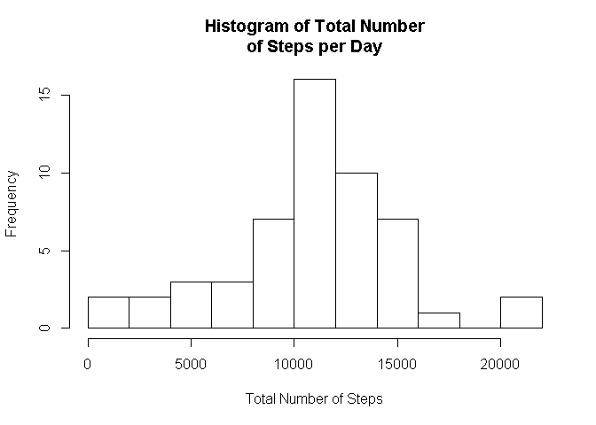
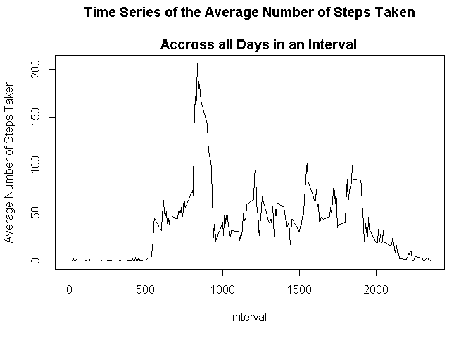
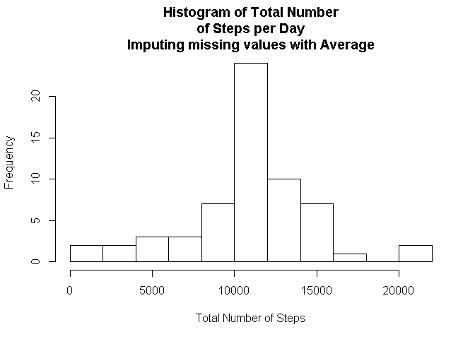
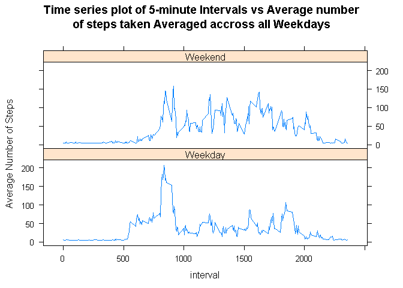

# Reproducible Research: Peer Assessment 1


## Loading and preprocessing the data


If the Comma Seperated CSV file does not exist than extract it from the zip file to a data directory


```r
if(!file.exists("./data/activity.csv")){
                # extract the file to the data folder
                unzip("activity.zip", exdir = "data", overwrite=TRUE)
}
```

Load the data into an activity variable

remove the NAs in the steps column

```r
activity <- read.csv("data/activity.csv")
activityWithoutNAs <- activity[!is.na(activity$steps),]
```

## What is mean total number of steps taken per day?

Calculate the total number of steps per day

1. Load necessary packages

2. Remove NAs

3. Group by day

4. Summarise total of steps per day

5. Draw a histogram.

```r
require(dplyr)
```

```
## Loading required package: dplyr
## 
## Attaching package: 'dplyr'
## 
## The following object is masked from 'package:stats':
## 
##     filter
## 
## The following objects are masked from 'package:base':
## 
##     intersect, setdiff, setequal, union
```

```r
grp <- filter(activity,!is.na(steps)) %>% group_by(day=date) %>% summarise(total=sum(steps))
hist(grp$total, main="Histogram of Total Number\nof Steps per Day", xlab="Total Number of Steps" ,breaks=12)
```

 

Mean of the total number of steps per day

```r
mean(grp$total)
```

```
## [1] 10766.19
```

Median of the total number of steps per day

```r
median(grp$total)
```

```
## [1] 10765
```

## What is the average daily activity pattern?

To Calculate the average daily pattern
1. Remove NA's 
2. Group by intervals
3. Get the average of the intervals accross the days


```r
pattern <- filter(activity,!is.na(steps)) %>% group_by(interval) %>% summarise(average = mean(steps))
```

Plot the pattern of average activity

```r
plot(pattern, type="l", ylab="Average Number of Steps Taken", 
     main="Time Series of the Average Number of Steps Taken\n
     Accross all Days in an Interval")
```

 

Calculate the 5-minute interval across all days which contains the maximum number of steps

```r
pattern$interval[pattern$average==max(pattern$average)]
```

```
## [1] 835
```

## Imputing missing values

Calculate the number of missing values in the dataset

```r
count(activity[!complete.cases(activity),])
```

```
## Source: local data frame [1 x 1]
## 
##      n
## 1 2304
```
Use the mean for the missing values

Create a new data set with the missing values replaced with mean

```r
require(Hmisc)
```

```
## Loading required package: Hmisc
## Loading required package: grid
## Loading required package: lattice
## Loading required package: survival
## Loading required package: splines
## Loading required package: Formula
## Loading required package: ggplot2
## 
## Attaching package: 'Hmisc'
## 
## The following objects are masked from 'package:dplyr':
## 
##     combine, src, summarize
## 
## The following objects are masked from 'package:base':
## 
##     format.pval, round.POSIXt, trunc.POSIXt, units
```

```r
imputed <- activity
imputed$steps <- with(imputed, impute(steps,mean))
imputedtotal <- tapply(imputed$steps, imputed$date,sum)
```

Create a histogram for the new dataset


```r
hist(imputedtotal, xlab="Total Number of Steps", 
     main="Histogram of Total Number\nof Steps per Day\nImputing missing values with Average", breaks=12)
```

 

Recalculate the Mean for this new dataset


```r
mean(imputedtotal)
```

```
## [1] 10766.19
```

Recalculate the Median for this new dataset


```r
median(imputedtotal)
```

```
## [1] 10766.19
```

The mean and median are virtually unaffected when mean is used for replacement

The old value for the average total number of steps per day 

```r
sum(grp$total)
```

```
## [1] 570608
```

The new value for the average total number of steps per day 

```r
sum(imputedtotal)
```

```
## [1] 656737.5
```

The new dataset has a larger value for the number of steps 

```r
sum(grp$total) < sum(imputedtotal)
```

```
## [1] TRUE
```
The standard Deviation is however narrower

```r
sd(grp$total) > sd(imputedtotal) 
```

```
## [1] TRUE
```

## Are there differences in activity patterns between weekdays and weekends?

Make a new field that seperates weekdays and weekends

```r
w <- mutate(imputed, weekday=ifelse(weekdays(as.Date(imputed$date)) %in% c("Sunday", "Saturday"), "Weekend", "Weekday"))
```

Make an aggregation for the mean

Load lattice

Make two plots side by side


```r
gridPlot <- aggregate(steps ~ interval + weekday, w, mean)

require(lattice)
xyplot(steps ~ interval | weekday, gridPlot, type="l", layout=c(1,2),
       main="Time series plot of 5-minute Intervals vs Average number\nof steps taken Averaged accross all Weekdays"
       , ylab="Average Number of Steps")
```

 
